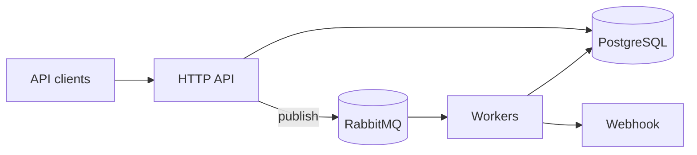

# NotifyStream

Event-driven notification pipeline in Go: HTTP API persists to PostgreSQL, publishes to RabbitMQ, and workers deliver JSON payloads to a configurable webhook (for example [webhook.site](https://webhook.site)).

## Architecture



- **Write path**: The API validates input, inserts rows in a transaction, commits, then publishes to AMQP. If publish fails, a row is written to the `outbox` table for later reconciliation (background publisher can be added separately).
- **Process path**: Workers consume per-channel queues, apply a per-channel token bucket (100 requests per second), POST to `WEBHOOK_URL`, update notification status, and retry transient failures before dead-lettering.

## Quick start

Prerequisites: Docker and Docker Compose.

1. Copy this repository and set `WEBHOOK_URL` in `docker-compose.yml` to your webhook endpoint, for example `https://webhook.site/<your-uuid>`.
2. Start the stack:

```bash
docker compose up --build
```

3. Open [Swagger UI](http://localhost:8080/swagger/index.html) for the live OpenAPI surface.
4. RabbitMQ management UI: [http://localhost:15672](http://localhost:15672) (default user and password `guest` / `guest`).

### Ports

| Service    | Port  |
| ---------- | ----- |
| API        | 8080  |
| Worker metrics | 9091 |
| PostgreSQL | 5432  |
| RabbitMQ AMQP | 5672 |
| RabbitMQ management | 15672 |

## Environment variables

| Variable        | Required | Default   | Description |
| --------------- | -------- | --------- | ----------- |
| `DATABASE_URL`  | yes      | —         | PostgreSQL connection string |
| `AMQP_URL`      | yes      | —         | RabbitMQ AMQP URL |
| `WEBHOOK_URL`   | worker: yes; API: optional for process | — | POST target for deliveries |
| `HTTP_ADDR`     | no       | `:8080`   | API listen address |
| `METRICS_ADDR`  | no       | (empty)   | Worker Prometheus metrics (`/metrics`) when set |

## RabbitMQ topology

| Piece | Purpose |
| ----- | ------- |
| Exchange `notifications.topic` (`topic`) | Routes work to channel queues |
| Routing keys | `notify.{channel}.{priority}` with `channel` in `sms`, `email`, `push` and `priority` in `high`, `normal`, `low` |
| Queues | `q.notify.sms`, `q.notify.email`, `q.notify.push` with `x-max-priority` (10) |
| Dead letter | `notifications.dlx` → `q.notify.dlq` (`notify.dlq`) |

## API examples

Replace `BASE` with your API origin (for example `http://localhost:8080`).

**Create a single SMS notification**

```bash
curl -sS -X POST "$BASE/v1/notifications" \
  -H 'Content-Type: application/json' \
  -d '{
    "notifications": [
      {
        "recipient": "+15551234567",
        "channel": "sms",
        "content": "Hello from NotifyStream",
        "priority": "normal"
      }
    ]
  }'
```

**Create with idempotency**

```bash
curl -sS -X POST "$BASE/v1/notifications" \
  -H 'Content-Type: application/json' \
  -H 'X-Request-ID: my-correlation-1' \
  -d '{
    "notifications": [
      {
        "recipient": "user@example.com",
        "channel": "email",
        "content": "Weekly digest\nHere is the body.",
        "priority": "high",
        "idempotency_key": "order-123-email"
      }
    ]
  }'
```

Email `content` uses the first line as the subject and the remainder as the body (see validation limits in code). Push uses the first line as title and the second segment as body.

**List notifications (cursor pagination)**

```bash
curl -sS "$BASE/v1/notifications?status=queued&limit=20"
```

**Get one notification**

```bash
curl -sS "$BASE/v1/notifications/<uuid>"
```

**Cancel**

```bash
curl -sS -X POST "$BASE/v1/notifications/<uuid>/cancel"
```

**Health and metrics**

- Liveness: `GET /healthz`
- Readiness (database + AMQP): `GET /readyz`
- Prometheus: `GET /metrics` on the API; worker exposes `/metrics` when `METRICS_ADDR` is set.

## OpenAPI / Swagger

Spec is generated with [swaggo](https://github.com/swaggo/swag). After changing handler `// @` annotations, regenerate:

```bash
go run github.com/swaggo/swag/cmd/swag@latest init -g cmd/api/main.go -o docs
```

The API serves **Swagger UI** at `/swagger/*` (for example [http://localhost:8080/swagger/index.html](http://localhost:8080/swagger/index.html)).

## Delivery and retry

1. Workers consume from `q.notify.{sms|email|push}` with prefetch QoS.
2. Each channel uses an in-memory token bucket at **100 events per second** per worker process. For multiple worker replicas, use a shared limiter (for example Redis) if you need a global cap.
3. The webhook client POSTs JSON `{ "to", "channel", "content?", "payload?", "priority" }` with a 10s timeout. Successful responses are **2xx**; optional `{"messageId":"..."}` in the body is stored as `provider_message_id`.
4. **429** and **5xx** / network errors are treated as transient: exponential backoff (from 250ms, capped at 30s with small jitter), republish with `x-retry-count` header, up to **5** attempts, then the notification is marked `failed`.
5. Other **4xx** responses are permanent: mark `failed` and **nack without requeue** so the message can dead-letter to `q.notify.dlq`.
6. Cancelled or already delivered notifications are skipped when consumed.

## Local development

```bash
make test
```

Lint (requires [golangci-lint](https://golangci-lint.run/) on your PATH, or use the Docker image `golangci/golangci-lint`):

```bash
make lint
```

Continuous integration runs `make test` and `golangci-lint` on pushes and pull requests to `main` and `master` (see `.github/workflows/ci.yml`).
